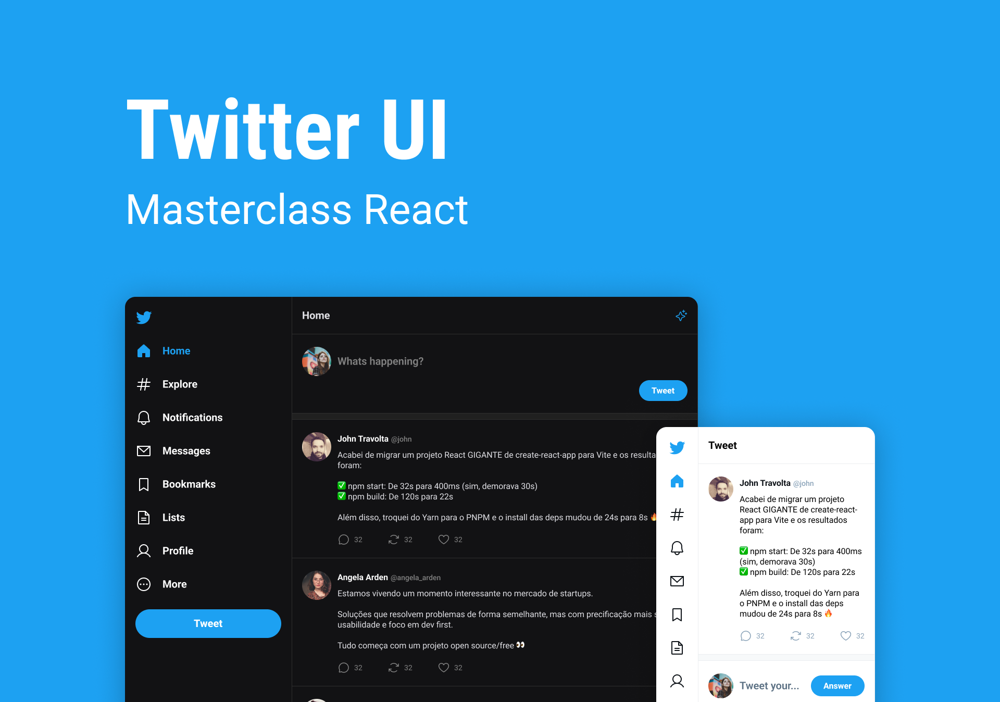

# Masterclass de React - Twitter UI clone
Projeto desenvolvido durante a masterclass de react da Rocketseat. A aplicação é recriar a interface do twitter para praticar os conceitos básicos de react (states, fluxo de renderização, components e roteamentos) e utilizando typescript para este desenvolvimento.

